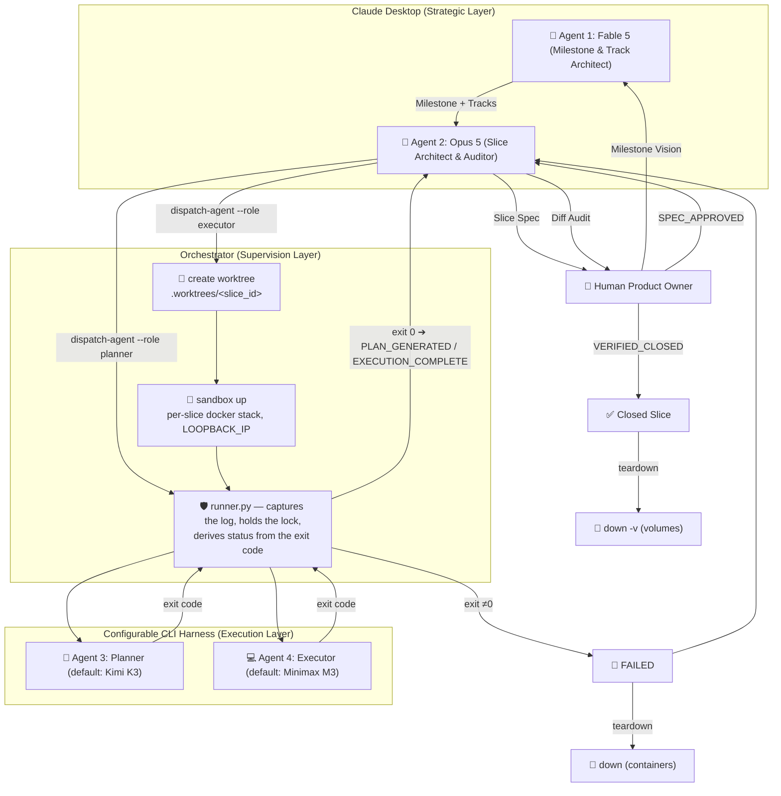

#  Superpowers Multi-Agents

> **An enterprise-grade, cost-optimized multi-agent orchestration framework extending [`obra/superpowers`](https://github.com/obra/superpowers).**


`superpowers-multiagents` separates strategic product design from heavy task planning and TDD code execution. By leveraging specialized LLM cost tiers, configurable CLI harnesses, and non-blocking background execution, it cuts token costs by 5x-10x while maintaining strict architectural quality.

---

## ⚡ Why Superpowers?

The core [`obra/superpowers`](https://github.com/obra/superpowers) methodology fundamentally transforms coding agents from chaotic code generators into disciplined software engineers:

* 🎯 **Design-First Hard Gates**: Agents are strictly forbidden from writing code until a detailed design spec is approved by the human.
* 🧪 **Rigorous Red/Green TDD**: Enforces writing failing tests first, verifying failure, writing minimal code to pass, and committing frequently.
* ✂️ **Ruthless YAGNI & DRY**: Prevents AI bloat, over-engineering, and premature abstractions.
* 🧩 **Decomposed Unit Isolation**: Breaks down complex requests into modular, bite-sized components with clear boundaries.

---

## 🚀 Why Superpowers Multi-Agents?

While Superpowers provides the core engineering discipline, executing large TDD plans solely on frontier models introduces severe cost bottlenecks and timeout crashes. **`superpowers-multiagents`** extends Superpowers into an enterprise-ready, N-level multi-agent pipeline:

> [!TIP]
> **5x–10x Token Cost Reduction**: By separating high-reasoning strategy from heavy TDD code execution, high-volume output runs under flat-rate subscriptions while top models focus on architecture and audit.

### 📊 Comparative Analysis Matrix

| Dimension | 🔴 Traditional API Orchestrators <br/> *(CrewAI, AutoGen, LangGraph)* | ⚡ **Superpowers Multi-Agents** <br/> *(Claude Desktop + Configurable CLI)* | Value & Impact |
| :--- | :--- | :--- | :--- |
| **💰 Billing Model** | **Pure Pay-Per-Token API**<br/>Every loop and test run bills input/output tokens. | **Flat-Rate Subscription**<br/>Heavy execution runs on configurable CLI harnesses. | **80–90% Cost Reduction** |
| **🧠 Strategic Layer** | **API Code Loop**<br/>Expensive models used for repetitive text outputs. | **Claude Desktop GUI**<br/>Top models focus purely on architecture and diff audit. | **High Reasoning, Low Cost** |
| **⚡ Execution Layer** | **Per-Token Metered API**<br/>3,000-line plans bill heavily per token. | **Background CLI Tasks**<br/>Unlimited TDD planning and testing at $0 extra cost. | **Uncapped Code Output** |
| **🛡 System Stability** | **60-Second Timeout Limits**<br/>Prone to crashes on long tasks. | **Non-Blocking OS Processes**<br/>Tasks run background for 1–2+ hours smoothly. | **Zero Timeout Crashes** |
| **📄 State Audit** | **Black-Box Database / Memory**<br/>State hidden inside framework memory. | **Single Source of Truth**<br/>Status derived from supervisor exit code; full agent transcript captured to `.superpowers/logs/`. | **100% Transparency** |

---

## 🏛 Architecture & Workflow

The framework implements a configurable N-level agent hierarchy. Agents, harnesses, providers, and models are all defined declaratively in `.superpowers/agents.yaml`. See [docs/architecture.md](docs/architecture.md) for the full module breakdown.



> **The agent never sets its own terminal status.** `dispatch-agent` returns as
> soon as the supervisor is spawned; the supervisor waits for the agent, writes
> its transcript to `.superpowers/logs/`, and converts the exit code into a
> status. An agent that crashes — or simply forgets to report — therefore
> cannot leave a slice stranded.

---

## 🔄 Vertical Slice State Machine

The lifecycle of every feature slice is tracked transparently inside Markdown **YAML Frontmatter**. Both statuses and transitions are configurable via `.superpowers/agents.yaml`. See [docs/configuration.md](docs/configuration.md) for the full schema.

| State | Responsible Agent | Action / Gate |
| :--- | :--- | :--- |
| `DRAFT_SPEC` | **Opus 5** | Drafting design spec and interface contracts. |
| `SPEC_APPROVED` | **Human Gate** | Human approves the design spec. |
| `PLANNING` | **Planner (configurable)** | Background worker generating detailed TDD plan. |
| `PLAN_GENERATED` | **Orchestrator (from exit code)** | `slice-N-plan.md` written to disk. |
| `PLAN_APPROVED` | **Opus 5 Gate** | Opus 5 audits plan against spec contracts. |
| `EXECUTING` | **Executor (configurable)**| Background TDD execution (Red ➔ Green ➔ Commit). |
| `EXECUTION_COMPLETE` | **Orchestrator (from exit code)** | All tasks finished & test suite 100% PASS. |
| `FAILED` | **Orchestrator** | Set by the orchestrator when the agent exits non-zero. |
| `VERIFIED_CLOSED` | **Opus 5 Gate** | Opus 5 audits `git diff` and marks slice closed. |

---

## 🔌 Generic Project Infrastructure Hooks

Projects can optionally define `.superpowers/hooks.yaml` in their repository root to trigger environment isolation and cleanup automatically.

**These names are the complete set the orchestrator emits.** A key that is not
one of them never fires — so the orchestrator reports it as an unknown event at
load time rather than leaving you to wonder why nothing happened. `{role}` is
each role defined in `agents.yaml`; with the default roles that is `planner` and
`executor`.

| Event | Fired by | When |
| :--- | :--- | :--- |
| `on_slice_{role}_start` | `dispatch-agent` | before the supervisor is spawned — fails the dispatch without touching the slice |
| `on_{role}_complete` | supervisor | the agent exited `0` |
| `on_{role}_failed` | supervisor | the agent exited non-zero |
| `on_slice_verified_closed` | `set-status` | after a successful merge |

`capture_env: true` parses the hook's stdout for `KEY=VALUE` (and `export KEY=VALUE`) lines and passes them into the agent's environment.

```yaml
# Example: .superpowers/hooks.yaml
hooks:
  on_slice_planner_start:
    command: "echo Preparing planning environment"

  on_slice_executor_start:
    command: "python .claude/skills/sandbox-loopback/scripts/sandbox_loopback.py up"
    capture_env: true

  on_planner_complete:
    command: "echo Plan generated"

  on_planner_failed:
    command: "echo Planning failed — see .superpowers/logs/"

  on_executor_complete:
    command: "python .claude/skills/sandbox-loopback/scripts/sandbox_loopback.py teardown --yes"

  on_executor_failed:
    command: "python .claude/skills/sandbox-loopback/scripts/sandbox_loopback.py teardown --yes"

  on_slice_verified_closed:
    command: "echo Slice verification complete"
```

**Per-slice infrastructure isolation via this hook is superseded.**
Prior to 2.1.0, `on_slice_executor_start` fired before the dispatched slice's
branch/worktree existed, so a branch-derived address resolved the same for
every slice in flight and parallel slices silently shared one stack. Use the
sandbox feature below instead — see
[docs/configuration.md](docs/configuration.md#sandbox-per-slice-infrastructure).

---

## 🐳 Parallel slices need isolated infrastructure

Optional and **opt-in**: with no `sandbox` block in `.superpowers/agents.yaml`
the orchestrator never makes a docker call. Declare one and each isolated
slice gets its own `docker compose` stack, published on its own
`127.0.0.x` loopback address, so two agents dispatched in parallel from
different worktrees never fight over the same host port. See
[docs/configuration.md](docs/configuration.md#sandbox-per-slice-infrastructure)
for the full schema, the template tokens, and the three teardown modes.

```bash
python -m scripts.orchestrator sandbox --dir . status
```

```
feat/slice-02-native-sandbox                    127.0.0.78   running
feat/slice-03-other-feature                     127.0.0.140  stopped
```

---

## 🗂 Runtime Artifacts

The orchestrator writes into the project it operates on. Everything it creates
lives under two directories, so one ignore rule covers it:

| Path | Contents |
| :--- | :--- |
| `.superpowers/logs/` | One transcript per dispatch: `<role>_<file stem>.log` |
| `.superpowers/locks/` | One lock per in-flight slice, naming the live supervisor PID |
| `.superpowers/sandbox/` | One JSON record per docker-compose project, keyed by project name; contains the branch it belongs to, its loopback address, and when it was started; removed only when the stack's volumes are destroyed |
| `.worktrees/` | Isolated worktrees for agents with `isolated_worktree: true` |

Add them to your `.gitignore` — `dispatch-agent` prints a reminder when they are
neither ignored nor tracked:

```gitignore
.superpowers/logs/
.superpowers/locks/
.superpowers/sandbox/
.worktrees/
```

Your `.gitignore` is never modified for you. The merge gate ignores these four
paths when deciding whether the tree is clean, so the orchestrator's own output
cannot block its own `VERIFIED_CLOSED` merge — but leaving them untracked will
otherwise clutter every diff you take.

---

## 🚑 When a Slice Fails

A non-zero exit from the agent puts the slice in `FAILED` and releases the lock.
Nothing is stranded and nothing needs hand-editing.

1. Read the transcript: `... summary --slice <slice-id> --dir .`
2. Fix the cause — a broken plan, a missing dependency, a failing environment hook.
3. Return the slice to the gate it came from and dispatch again:

```bash
# planning failed -> back to the spec gate
python -m scripts.orchestrator set-status --file docs/superpowers/specs/<spec>.md --status SPEC_APPROVED

# execution failed -> back to the plan gate
python -m scripts.orchestrator set-status --file docs/superpowers/plans/<plan>.md --status PLAN_APPROVED
```

`FAILED` accepts exactly these two transitions, because they are the entry
points of the planner and executor roles.

---

## 🛠 Quickstart

### 1. Installation

```bash
git clone https://github.com/ramil-zakirov-dev/superpowers-multiagents.git
cd superpowers-multiagents
pip install -r requirements.txt
```

### 2. Check Workflow Status

From a clone:
```bash
python -m scripts.orchestrator status --dir docs/superpowers
```

When installed as a plugin:
```bash
python "/abs/path/to/plugin/scripts/orchestrator.py" status --dir docs/superpowers
```

The same absolute-path form works for every command below — `dispatch-agent`,
`set-status`, `trigger-hook`, `summary` — not just `status`; it's shown once
here for brevity.

### 3. Dispatch Agent (Generic)

```bash
# Dispatch any configured agent by role:
python -m scripts.orchestrator dispatch-agent --role planner --file docs/superpowers/specs/2026-07-25-slice-01-auth-design.md

# Override model at runtime:
python -m scripts.orchestrator dispatch-agent --role executor --file docs/superpowers/plans/2026-07-25-slice-01-auth-plan.md --model claude-sonnet-4
```

### 4. Legacy Aliases (Backward Compatible)

```bash
python -m scripts.orchestrator dispatch-planner --spec docs/superpowers/specs/2026-07-25-slice-01-auth-design.md
python -m scripts.orchestrator dispatch-executor --plan docs/superpowers/plans/2026-07-25-slice-01-auth-plan.md
```

### 5. Set Status & Trigger Hooks

```bash
python -m scripts.orchestrator set-status --file docs/superpowers/plans/2026-07-25-slice-01-auth-plan.md --status PLAN_APPROVED
python -m scripts.orchestrator trigger-hook --event on_slice_executor_start --dir .
```

---

## 🧪 Testing

```bash
python -m pytest tests/ -v -p no:cacheprovider
```

No test invokes a real harness — dispatch tests wire in a stub adapter instead.

---

## 📁 Repository Structure

```
superpowers-multiagents/
├── .claude-plugin/
│   └── plugin.json             # Claude Code / Desktop plugin manifest
├── assets/
│   ├── banner.png              # Project banner graphic
│   ├── icon.png                # 24x24 project icon (PNG)
│   └── icon.svg                # 24x24 project icon (SVG)
├── docs/
│   ├── architecture.md         # Module structure & design principles
│   └── configuration.md        # Full agents.yaml schema reference
├── hooks/
│   ├── hooks.json              # Hook registration
│   └── session-start           # SessionStart prompt injector
├── skills/
│   └── multiagent-orchestrator/
│       └── SKILL.md            # Multi-Agent orchestrator instructions
├── scripts/
│   ├── orchestrator.py         # CLI entry point & command handlers
│   ├── config.py               # DEFAULT_CONFIG & agents.yaml loader
│   ├── errors.py               # Exception hierarchy
│   ├── paths.py                # Runtime artifact layout
│   ├── runner.py               # Supervisor for background agent execution
│   ├── frontmatter.py          # YAML frontmatter parsing & atomic updates
│   ├── git_ops.py              # Git worktree & merge operations
│   ├── hooks.py                # Infrastructure hook execution
│   ├── locks.py                # File-based slice locking
│   ├── dependencies.py         # Slice dependency checking
│   ├── utils.py                # ID validation, YAML conversion, project root
│   └── adapters/
│       ├── __init__.py         # Public adapter API
│       ├── base.py             # HarnessAdapter abstract base class
│       ├── opencode.py         # OpenCode CLI adapter (default)
│       └── loader.py           # Dynamic adapter resolution & custom loading
├── tests/
│   ├── test_orchestrator.py    # Pytest test suite
│   ├── test_docs_consistency.py # Documentation and metadata verification
│   ├── test_set_status.py      # Status transition tests
│   ├── test_hook_events.py     # Hook event firing tests
│   └── ...
├── .superpowers/
│   ├── logs/                   # Runtime execution logs (created on dispatch)
│   └── locks/                  # Slice lock files (created on dispatch)
├── package.json
├── requirements.txt            # Python dependencies (ruamel.yaml, pytest)
└── README.md
```

---

## 📜 License

Distributed under the [MIT License](LICENSE).
