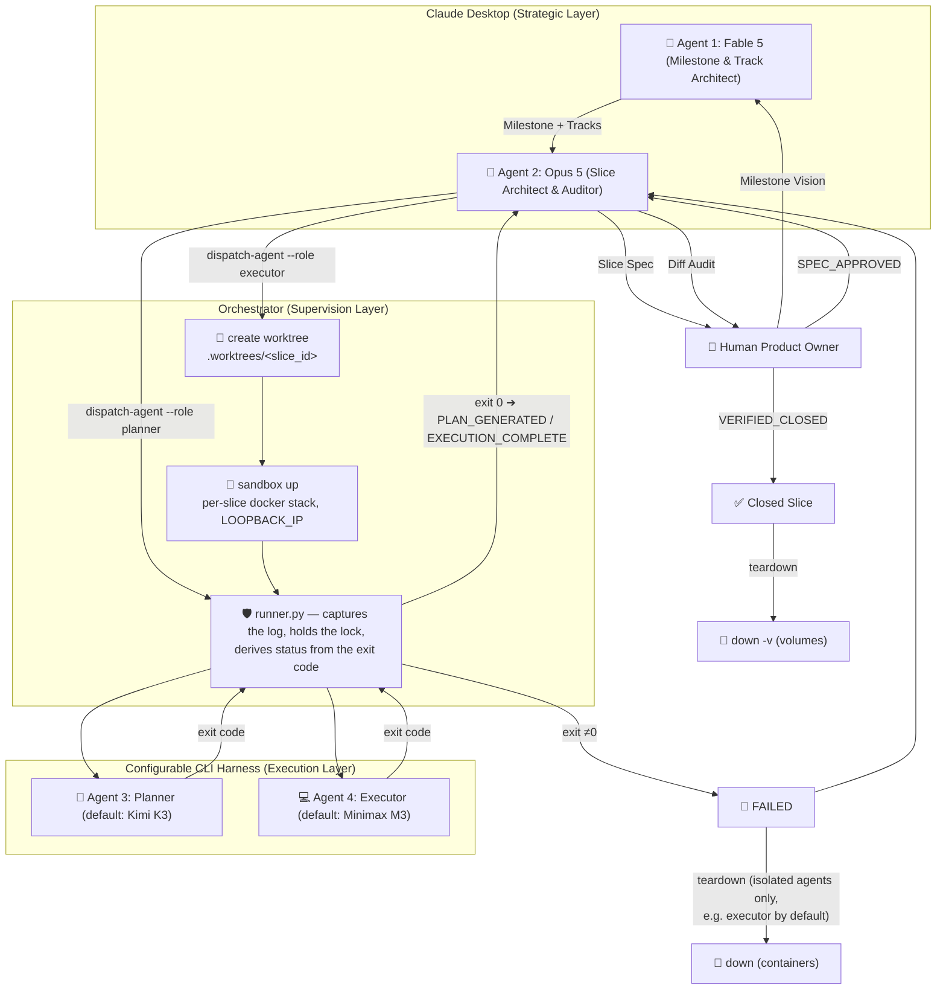
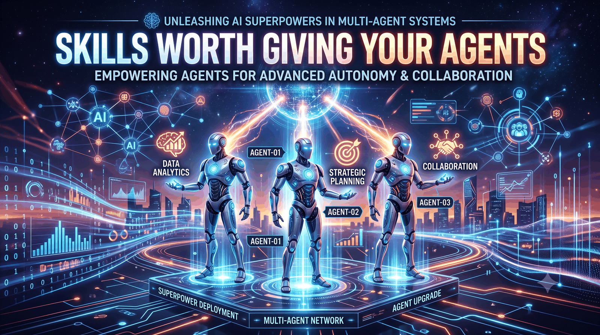

#  Superpowers Multi-Agents

> **An enterprise-grade, cost-optimized multi-agent orchestration framework extending [`obra/superpowers`](https://github.com/obra/superpowers).**


`superpowers-multiagents` separates strategic product design from heavy task planning and TDD code execution. By leveraging specialized LLM cost tiers, configurable CLI harnesses, and non-blocking background execution, it cuts token costs by 5x-10x while maintaining strict architectural quality.

---

## ⚡ Why Superpowers?

The core [`obra/superpowers`](https://github.com/obra/superpowers) methodology fundamentally transforms coding agents from chaotic code generators into disciplined software engineers:

* 🎯 **Design-First Hard Gates**: Agents are strictly forbidden from writing code until a detailed design spec is approved by the human.
* 🧪 **Rigorous Red/Green TDD**: Enforces writing failing tests first, verifying failure, writing minimal code to pass, and committing frequently.
* ✂️ **Ruthless YAGNI & DRY**: Prevents AI bloat, over-engineering, and premature abstractions.
* 🧩 **Decomposed Unit Isolation**: Breaks down complex requests into modular, bite-sized components with clear boundaries.

---

## 🚀 Why Superpowers Multi-Agents?

While Superpowers provides the core engineering discipline, executing large TDD plans solely on frontier models introduces severe cost bottlenecks and timeout crashes. **`superpowers-multiagents`** extends Superpowers into an enterprise-ready, N-level multi-agent pipeline:

> [!TIP]
> **5x–10x Token Cost Reduction**: By separating high-reasoning strategy from heavy TDD code execution, high-volume output runs under flat-rate subscriptions while top models focus on architecture and audit.

### 📊 Comparative Analysis Matrix

| Dimension | 🔴 Traditional API Orchestrators <br/> *(CrewAI, AutoGen, LangGraph)* | ⚡ **Superpowers Multi-Agents** <br/> *(Claude Desktop + Configurable CLI)* | Value & Impact |
| :--- | :--- | :--- | :--- |
| **💰 Billing Model** | **Pure Pay-Per-Token API**<br/>Every loop and test run bills input/output tokens. | **Flat-Rate Subscription**<br/>Heavy execution runs on configurable CLI harnesses. | **80–90% Cost Reduction** |
| **🧠 Strategic Layer** | **API Code Loop**<br/>Expensive models used for repetitive text outputs. | **Claude Desktop GUI**<br/>Top models focus purely on architecture and diff audit. | **High Reasoning, Low Cost** |
| **⚡ Execution Layer** | **Per-Token Metered API**<br/>3,000-line plans bill heavily per token. | **Background CLI Tasks**<br/>Unlimited TDD planning and testing at $0 extra cost. | **Uncapped Code Output** |
| **🛡 System Stability** | **60-Second Timeout Limits**<br/>Prone to crashes on long tasks. | **Non-Blocking OS Processes**<br/>Tasks run background for 1–2+ hours smoothly. | **Zero Timeout Crashes** |
| **📄 State Audit** | **Black-Box Database / Memory**<br/>State hidden inside framework memory. | **Single Source of Truth**<br/>Status derived from supervisor exit code; full agent transcript captured to `.superpowers/logs/`. | **100% Transparency** |

---

## 🏛 Architecture & Workflow

The framework implements a configurable N-level agent hierarchy. Agents, harnesses, providers, and models are all defined declaratively in `.superpowers/agents.yaml`. See [docs/architecture.md](docs/architecture.md) for the full module breakdown.



> **The agent never sets its own terminal status.** `dispatch-agent` returns as
> soon as the supervisor is spawned; the supervisor waits for the agent, writes
> its transcript to `.superpowers/logs/`, and converts the exit code into a
> status. An agent that crashes — or simply forgets to report — therefore
> cannot leave a slice stranded.

---

## 🔄 Vertical Slice State Machine

The lifecycle of every feature slice is tracked transparently inside Markdown **YAML Frontmatter**. Both statuses and transitions are configurable via `.superpowers/agents.yaml`. See [docs/configuration.md](docs/configuration.md) for the full schema.

| State | Responsible Agent | Action / Gate |
| :--- | :--- | :--- |
| `DRAFT_SPEC` | **Opus 5** | Drafting design spec and interface contracts. |
| `SPEC_APPROVED` | **Human Gate** | Human approves the design spec. |
| `PLANNING` | **Planner (configurable)** | Background worker generating detailed TDD plan. |
| `PLAN_GENERATED` | **Orchestrator (from exit code)** | `slice-N-plan.md` written to disk. |
| `PLAN_APPROVED` | **Opus 5 Gate** | Opus 5 audits plan against spec contracts. |
| `EXECUTING` | **Executor (configurable)**| Background TDD execution (Red ➔ Green ➔ Commit). |
| `EXECUTION_COMPLETE` | **Orchestrator (from exit code)** | All tasks finished & test suite 100% PASS. |
| `FAILED` | **Orchestrator** | Set by the orchestrator when the agent exits non-zero. |
| `VERIFIED_CLOSED` | **Opus 5 Gate** | Opus 5 audits `git diff` and marks slice closed. |

### Milestone lifecycle

A milestone brief is a second document kind, declared by `kind: milestone`. A
document that declares none is a slice, so nothing existing changes.

| State | Responsible | Action / Gate |
| :--- | :--- | :--- |
| `MILESTONE_DRAFT` | **Agent 1** | Writing the brief. |
| `MILESTONE_ACTIVE` | **Human Gate** | Approved — refused while any required section is empty. |
| `MILESTONE_CLOSED` | **Human Gate** | The objective was met — refused while any listed slice is open. |

No agent is ever dispatched against a brief, so there is no `FAILED` here and no
branch to merge. Track checkboxes are derived from the real statuses of the
slices a track lists; closing a slice refreshes them in the same command. See
[docs/configuration.md](docs/configuration.md#milestone-briefs).

---

## 🔌 Generic Project Infrastructure Hooks

Projects can optionally define `.superpowers/hooks.yaml` in their repository root to trigger environment isolation and cleanup automatically.

**These names are the complete set the orchestrator emits.** A key that is not
one of them never fires — so the orchestrator reports it as an unknown event at
load time rather than leaving you to wonder why nothing happened. `{role}` is
each role defined in `agents.yaml`; with the default roles that is `planner` and
`executor`.

| Event | Fired by | When |
| :--- | :--- | :--- |
| `on_slice_{role}_start` | `dispatch-agent` | before the supervisor is spawned — fails the dispatch without touching the slice |
| `on_{role}_complete` | supervisor | the agent exited `0` |
| `on_{role}_failed` | supervisor | the agent exited non-zero |
| `on_slice_verified_closed` | `set-status` | after a successful merge |

`capture_env: true` parses the hook's stdout for `KEY=VALUE` (and `export KEY=VALUE`) lines and passes them into the agent's environment.

```yaml
# Example: .superpowers/hooks.yaml
hooks:
  on_slice_planner_start:
    command: "echo Preparing planning environment"

  on_slice_executor_start:
    command: "python .claude/skills/sandbox-loopback/scripts/sandbox_loopback.py up"
    capture_env: true

  on_planner_complete:
    command: "echo Plan generated"

  on_planner_failed:
    command: "echo Planning failed — see .superpowers/logs/"

  on_executor_complete:
    command: "python .claude/skills/sandbox-loopback/scripts/sandbox_loopback.py teardown --yes"

  on_executor_failed:
    command: "python .claude/skills/sandbox-loopback/scripts/sandbox_loopback.py teardown --yes"

  on_slice_verified_closed:
    command: "echo Slice verification complete"
```

**Per-slice infrastructure isolation via this hook is superseded.**
Prior to 2.1.0, `on_slice_executor_start` fired before the dispatched slice's
branch/worktree existed, so a branch-derived address resolved the same for
every slice in flight and parallel slices silently shared one stack. Use the
sandbox feature below instead — see
[docs/configuration.md](docs/configuration.md#sandbox-per-slice-infrastructure).

---

## 🐳 Parallel slices need isolated infrastructure

Optional and **opt-in**: with no `sandbox` block in `.superpowers/agents.yaml`
the orchestrator never makes a docker call. Declare one and each isolated
slice gets its own `docker compose` stack, published on its own
`127.0.0.x` loopback address, so two agents dispatched in parallel from
different worktrees never fight over the same host port. See
[docs/configuration.md](docs/configuration.md#sandbox-per-slice-infrastructure)
for the full schema, the template tokens, and the three teardown modes.

```bash
python -m scripts.orchestrator sandbox --dir . status
```

```
feat/slice-02-native-sandbox                    127.0.0.78   running
feat/slice-03-other-feature                     127.0.0.140  stopped
```

---

## 🌿 Branches and Worktrees — the Plugin Owns Both

Branch creation here is **mechanical**, not a habit you bring with you. Three
rules follow from one command, `git worktree add -b feat/<slice_id>
.worktrees/<slice_id> HEAD`:

**Do not create a slice branch by hand.** The dispatcher derives
`feat/<slice_id>` from the document's frontmatter. A hand-made
`feature/<slice_id>` is a *different* branch three characters away, and
`close-slice` merges only the derived one — the other lingers looking like
unfinished work. `dispatch-agent` prints a hint when it sees both.

**Commit specs and plans on the branch checked out in the main working tree
before dispatching.** That branch is what the planner reads (it has
`isolated_worktree: false` and runs in the project root) and what the executor's
worktree forks from. An uncommitted document is not in HEAD, so it is not in the
worktree: dispatching an isolated role at one is refused, by name, rather than
handed to an agent that will fail later for a reason it cannot explain. In the
normal case the branch you commit on is your integration branch.

**`.worktrees/<slice_id>` belongs to the plugin.** Do not create, move or delete
it yourself; `close-slice` removes it after the merge, and a failed dispatch
leaves it in place on purpose, so the transcript and the work are still there to
read.

---

## 🗂 Runtime Artifacts

The orchestrator writes into the project it operates on. Everything it creates
lives under two directories, so one ignore rule covers it:

| Path | Contents |
| :--- | :--- |
| `.superpowers/logs/` | One transcript per dispatch: `<role>_<file stem>.log` |
| `.superpowers/locks/` | One lock per in-flight slice, naming the live supervisor PID |
| `.superpowers/sandbox/` | One JSON record per docker-compose project, keyed by project name; contains the branch it belongs to, its loopback address, and when it was started; removed only when the stack's volumes are destroyed |
| `.worktrees/` | Isolated worktrees for agents with `isolated_worktree: true` |

Add them to your `.gitignore` — `dispatch-agent` prints a reminder when they are
neither ignored nor tracked:

```gitignore
.superpowers/logs/
.superpowers/locks/
.superpowers/sandbox/
.worktrees/
```

Your `.gitignore` is never modified for you. The merge gate ignores these four
paths when deciding whether the tree is clean, so the orchestrator's own output
cannot block its own `VERIFIED_CLOSED` merge — but leaving them untracked will
otherwise clutter every diff you take.

---

## 🚑 When a Slice Fails

A non-zero exit from the agent puts the slice in `FAILED` and releases the lock.
Nothing is stranded and nothing needs hand-editing.

1. Read the transcript: `... summary --slice <slice-id> --dir .`
2. Fix the cause — a broken plan, a missing dependency, a failing environment hook.
3. Return the slice to the gate it came from and dispatch again:

```bash
# planning failed -> back to the spec gate
python -m scripts.orchestrator set-status --file docs/superpowers/specs/<spec>.md --status SPEC_APPROVED

# execution failed -> back to the plan gate
python -m scripts.orchestrator set-status --file docs/superpowers/plans/<plan>.md --status PLAN_APPROVED
```

`FAILED` accepts exactly these two transitions, because they are the entry
points of the planner and executor roles.

---

## 🛠 Quickstart

### 1. Installation

```bash
claude plugin marketplace add ramil-zakirov-dev/superpowers-multiagents
claude plugin install superpowers-multiagents@ramil-zakirov-dev
```

The repository is its own marketplace, so the two commands name the same
project: the first registers it, the second installs the plugin.

To work **on** the plugin rather than with it, clone it and install the Python
dependencies — this makes the orchestrator runnable as a program, and does not
install anything into Claude Code:

```bash
git clone https://github.com/ramil-zakirov-dev/superpowers-multiagents.git
cd superpowers-multiagents
pip install -r requirements.txt
```

**Prerequisite — the dispatched harness needs the Superpowers skills.** The
default prompts send the planner to `writing-plans` and the executor to
`subagent-driven-development`; this plugin ships neither and cannot see whether
the harness has them, so a missing skill degrades silently rather than failing.
For OpenCode, declare the plugin in `opencode.json`:

```json
{ "plugin": ["superpowers@git+https://github.com/obra/superpowers.git"] }
```

Using a harness without those skills is fine — override each role's
`prompt_template` instead. See
[docs/configuration.md](docs/configuration.md#prompt-templates-and-their-skill-dependency).

Separately — for a harness that already has the skills you want — a role can
name them via the `skills` list under `agents.<role>` in
`.superpowers/agents.yaml`. The names are appended to the rendered prompt as
reinforcement, not a replacement for `prompt_template`. See
[docs/configuration.md](docs/configuration.md#skills-per-role-reinforcement) for
the schema, and **[Skills Worth Giving Your Agents](#-skills-worth-giving-your-agents)**
below for which skills to install and where to find them.

A role can also carry `instructions` — your project's rules for how that role
must work, appended last and above whatever standing instructions the harness
loaded on its own (OpenCode reads a global `AGENTS.md` in every session, and it
can contradict the project it was dispatched into). See
[docs/configuration.md](docs/configuration.md#instructions-per-role-project-rules).

### 2. Check Workflow Status

From a clone:
```bash
python -m scripts.orchestrator status --dir docs/superpowers
```

When installed as a plugin:
```bash
python "/abs/path/to/plugin/scripts/orchestrator.py" status --dir docs/superpowers
```

The same absolute-path form works for every command below — `dispatch-agent`,
`set-status`, `trigger-hook`, `summary` — not just `status`; it's shown once
here for brevity.

The report lists the documents the state machine can act on, and answers three
different questions in three different ways:

| The document | The report |
| :--- | :--- |
| carries a real status | one row, as always |
| carries a status or `kind` the machine does not have | one row marked `INVALID`, saying which — never hidden, because nothing will ever move it |
| carries no `status:` at all | counted, not listed: it predates the pipeline or was never meant to enter it |

That last line is what keeps the report readable in a repository with history.
Adopting the plugin into one does not mean backfilling frontmatter into every
document you have ever written — writing a lifecycle state onto a closed
historical design doc would be a claim about it that is not true. Pass `--all`
when you do want to see them.

### 3. Start a Milestone

```bash
python "/abs/path/to/plugin/scripts/orchestrator.py" milestone new --id milestone-1 --title "Intake automation"
```

Fill every section of the generated brief, then approve it:

```bash
python "/abs/path/to/plugin/scripts/orchestrator.py" set-status --file docs/superpowers/milestones/<file>.md --status MILESTONE_ACTIVE
```

### 4. Dispatch Agent (Generic)

```bash
# Dispatch any configured agent by role:
python -m scripts.orchestrator dispatch-agent --role planner --file docs/superpowers/specs/2026-07-25-slice-01-auth-design.md

# Override model at runtime:
python -m scripts.orchestrator dispatch-agent --role executor --file docs/superpowers/plans/2026-07-25-slice-01-auth-plan.md --model claude-sonnet-4
```

### 5. Legacy Aliases (Backward Compatible)

```bash
python -m scripts.orchestrator dispatch-planner --spec docs/superpowers/specs/2026-07-25-slice-01-auth-design.md
python -m scripts.orchestrator dispatch-executor --plan docs/superpowers/plans/2026-07-25-slice-01-auth-plan.md
```

### 6. Set Status & Trigger Hooks

```bash
python -m scripts.orchestrator set-status --file docs/superpowers/plans/2026-07-25-slice-01-auth-plan.md --status PLAN_APPROVED
python -m scripts.orchestrator trigger-hook --event on_slice_executor_start --dir .
```

---

## 🧠 Skills Worth Giving Your Agents



This plugin routes work between agents. It does not make any of them think
better. That comes from **skills** — Markdown instruction files the harness
discovers by directory and the model loads on demand. Once a role names them
under `skills:`, every dispatch of that role carries them.

### The selection rule: take lenses, not pipelines

The single mistake worth avoiding. A skill that offers a **way to think** —
Dependency Rule, bounded contexts, stability patterns — *composes* with this
plugin. A skill that offers its **own route from work to release** (`to-spec`,
`to-tickets`, `implement`, `tdd`, `wayfinder`) *competes* with the state machine
you already run, and when both are active the model picks one silently and never
tells you.

> **Rule of thumb.** If a skill's description contains a workflow, you already
> have one. If it contains a vocabulary, you probably want it.

### Where to get them

| Source | What it is | Best for |
|---|---|---|
| **[wondelai/skills](https://github.com/wondelai/skills)** | 62 skills distilled from well-known books — Clean Architecture, DDD, Refactoring, Release It!, Design of Everyday Things. Pure Markdown, MIT, **zero executable files**. Each is a ~200-line `SKILL.md` plus `references/` loaded only on demand. | Exactly the lens shape described above. Start here. |
| **[skills.sh](https://www.skills.sh/)** | The hub and the `npx skills` CLI: search across published repositories, install per skill, target any of 70+ agents (`claude-code`, `opencode`, `codex`, `cursor`, …). | Discovery, and the one install path that works for both harnesses at once. |

### Install

Globally, for both harnesses, in one command — repeat `-s` per skill, because
the CLI does not parse a comma list and silently matches nothing if you use one:

```bash
npx skills add wondelai/skills -s clean-architecture -s domain-driven-design -s clean-code -s refactoring-patterns -a claude-code -a opencode -g -y --copy
```

Browse before committing to anything:

```bash
npx skills find --owner wondelai
```

| Flag | Why it matters |
|---|---|
| `--copy` | **Required in practice.** The default symlinks break on Windows and inside git worktrees. |
| `-g` / `-p` | `-g` installs per user (`~/.claude/skills/`, `~/.agents/skills/`) and is visible from any working directory — including an executor's isolated worktree. `-p` installs into the repository and writes a `skills-lock.json` pinning every skill by SHA-256, but then the files **must be committed**: `git worktree add` populates a worktree with tracked files only. |
| `-a` | Name each harness you dispatch to. At project scope one directory serves both; globally they use different ones. |
| `--all` | **Don't.** A skill is an instruction that overrides model behaviour — installing a catalogue unread is running unread code, and every description sits in context for the rest of the session. |

wondelai also publishes a Claude Code marketplace (`/plugin marketplace add
wondelai/skills`), but its collections are coarse: `ux-design` brings eleven
skills, `systems-architecture` six. Per-skill installation is what lets you take
two and leave the rest.

### Wire them to roles

```yaml
# .superpowers/agents.yaml — requires plugin >= 2.4.0
agents:
  planner:
    skills: [clean-architecture, domain-driven-design]
  executor:
    skills: [clean-code, refactoring-patterns]
```

`skills` is the only key set here, so `model`, `harness` and — importantly —
`prompt_template` keep coming from the plugin's defaults and keep improving with
it. Name the lenses a role applies to its own decisions; there is no magic
number. A lens that changed nothing in the output was the wrong lens, and that
— not a count — is what limits the list.

Which lens suits which role:

| Role | Lenses | Why |
|---|---|---|
| `planner` | `clean-architecture`, `domain-driven-design` | It decides which layer code belongs to and what the domain calls it — the decisions most expensive to undo later. |
| `executor` | `clean-code`, `refactoring-patterns` | Craft at the code level. Architecture opinions here would compete with the plan it was handed. |
| *(neither)* | `release-it`, `good-strategy-bad-strategy`, `ux-heuristics` | These serve whoever writes the spec or designs the screens — a human-facing session, not a dispatched role. Both harnesses discover them from disk anyway. |

### Verify, don't assume

Ask the harness what it actually resolved. No model call, no cost:

```bash
opencode debug skill
```

At dispatch the orchestrator asks the same question through the adapter and
prints a hint for any name it cannot find. That hint is advisory — skills are
reinforcement, not a dependency, so a missing one never blocks a dispatch. The
failure mode to watch for is therefore **quiet**: output that is weaker than it
should be, with a `Hint: these skills are not visible to the harness` line
scrolled somewhere above.

Two things the install output will tell you and this README will not: the CLI
reports Socket and Snyk risk rows per skill, and it emits install telemetry.

---

## 🧪 Testing

```bash
python -m pytest tests/ -v -p no:cacheprovider
```

No test invokes a real harness — dispatch tests wire in a stub adapter instead.

---

## ⌨️ Commands

Available once the plugin is installed. Each wraps the CLI shown above; the
orchestrator path inside them is expanded by the harness, so nothing derives
it.

| Command | Effect |
| :--- | :--- |
| `/superpowers-multiagents:status` | Read the state of every milestone, spec and plan |
| `/superpowers-multiagents:new-milestone <id> <title>` | Create a milestone brief |
| `/superpowers-multiagents:activate-milestone <brief>` | `MILESTONE_DRAFT` → `MILESTONE_ACTIVE` |
| `/superpowers-multiagents:approve-spec <spec>` | `DRAFT_SPEC` → `SPEC_APPROVED` |
| `/superpowers-multiagents:approve-plan <plan>` | `PLAN_GENERATED` → `PLAN_APPROVED` |
| `/superpowers-multiagents:close-slice <plan> [--skip-merge]` | `EXECUTION_COMPLETE` → `VERIFIED_CLOSED`, merge, re-sync briefs |
| `/superpowers-multiagents:close-milestone <brief>` | `MILESTONE_ACTIVE` → `MILESTONE_CLOSED` |
| `/superpowers-multiagents:dispatch <role> <file>` | Dispatch a configured agent role |

`milestone sync`, `milestone check`, `summary`, `trigger-hook` and `sandbox`
have no commands — they are not steps of the operating procedure. Use the CLI.

`close-slice` merges `feat/<slice_id>` before it records the status, so it
refuses when that branch does not exist. `--skip-merge` closes the slice
without merging, for work that landed fast-forward or whose branch was deleted
once merged. It is an assertion the orchestrator cannot check: pass it only
when you know the work is already on the current branch.

---

## 📁 Repository Structure

```
superpowers-multiagents/
├── .claude-plugin/
│   ├── plugin.json             # Claude Code / Desktop plugin manifest
│   └── marketplace.json        # Marketplace descriptor: this repo publishes itself
├── assets/
│   ├── banner.png              # Project banner graphic
│   ├── icon.png                # 24x24 project icon (PNG)
│   └── icon.svg                # 24x24 project icon (SVG)
├── commands/                   # Slash commands over the orchestrator CLI
│   ├── status.md               # Read the whole lifecycle state
│   ├── new-milestone.md        # Create a milestone brief
│   ├── activate-milestone.md   # MILESTONE_DRAFT -> MILESTONE_ACTIVE
│   ├── approve-spec.md         # DRAFT_SPEC -> SPEC_APPROVED
│   ├── approve-plan.md         # PLAN_GENERATED -> PLAN_APPROVED
│   ├── close-slice.md          # EXECUTION_COMPLETE -> VERIFIED_CLOSED
│   ├── close-milestone.md      # MILESTONE_ACTIVE -> MILESTONE_CLOSED
│   └── dispatch.md             # Dispatch a configured agent role
├── docs/
│   ├── architecture.md         # Module structure & design principles
│   └── configuration.md        # Full agents.yaml schema reference
├── hooks/
│   ├── hooks.json              # Hook registration
│   └── session-start           # SessionStart prompt injector
├── skills/
│   └── multiagent-orchestrator/
│       └── SKILL.md            # Multi-Agent orchestrator instructions
├── scripts/
│   ├── orchestrator.py         # CLI entry point & command handlers
│   ├── config.py               # DEFAULT_CONFIG & agents.yaml loader
│   ├── errors.py               # Exception hierarchy
│   ├── paths.py                # Runtime artifact layout
│   ├── runner.py               # Supervisor for background agent execution
│   ├── frontmatter.py          # YAML frontmatter parsing & atomic updates
│   ├── git_ops.py              # Git worktree & merge operations
│   ├── hooks.py                # Infrastructure hook execution
│   ├── locks.py                # File-based slice locking
│   ├── dependencies.py         # Slice dependency checking
│   ├── utils.py                # ID validation, YAML conversion, project root
│   └── adapters/
│       ├── __init__.py         # Public adapter API
│       ├── base.py             # HarnessAdapter abstract base class
│       ├── opencode.py         # OpenCode CLI adapter (default)
│       └── loader.py           # Dynamic adapter resolution & custom loading
├── tests/
│   ├── test_orchestrator.py    # Pytest test suite
│   ├── test_docs_consistency.py # Documentation and metadata verification
│   ├── test_set_status.py      # Status transition tests
│   ├── test_hook_events.py     # Hook event firing tests
│   └── ...
├── .superpowers/
│   ├── logs/                   # Runtime execution logs (created on dispatch)
│   └── locks/                  # Slice lock files (created on dispatch)
├── package.json
├── requirements.txt            # Python dependencies (ruamel.yaml, pytest)
└── README.md
```

---

## 📜 License

Distributed under the [MIT License](LICENSE).
