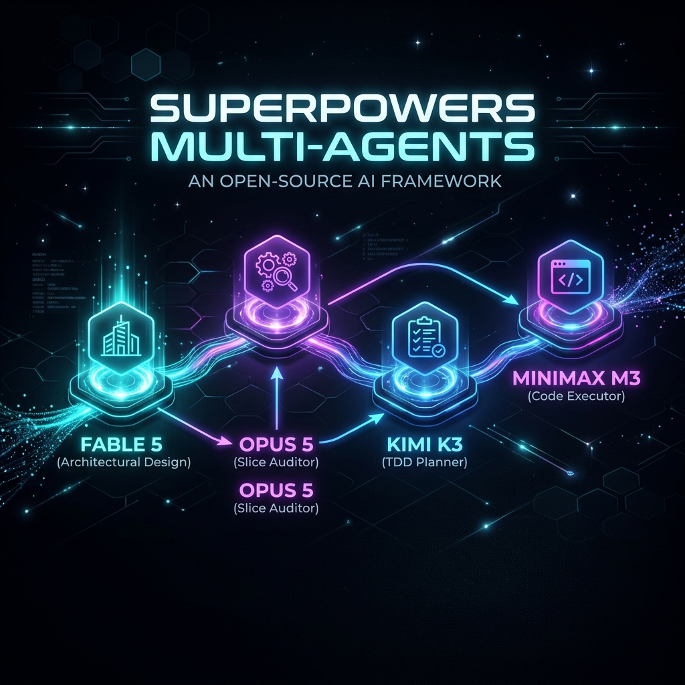
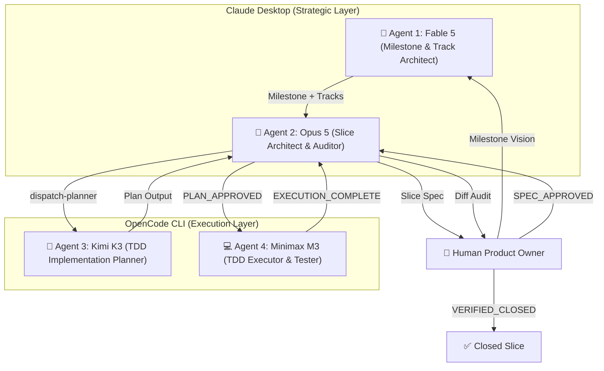

# 🚀 Superpowers Multi-Agents

> **An enterprise-grade, cost-optimized 4-level LLM multi-agent orchestration framework extending [`obra/superpowers`](https://github.com/obra/superpowers).**




`superpowers-multiagents` separates strategic product design from heavy task planning and TDD code execution. By leveraging specialized LLM cost tiers and non-blocking background CLI execution in [OpenCode](https://github.com/opencode), it cuts token costs by 5x-10x while maintaining strict architectural quality.

---

## ⚡ Why Superpowers?

The core [`obra/superpowers`](https://github.com/obra/superpowers) methodology fundamentally transforms coding agents from chaotic code generators into disciplined software engineers:

* 🎯 **Design-First Hard Gates**: Agents are strictly forbidden from writing code or scaffolding projects until a detailed design specification is presented and approved by the human.
* 🧪 **Rigorous Red/Green TDD**: Enforces writing failing tests first, verifying failure, writing minimal code to make tests pass, and committing frequently.
* ✂️ **Ruthless YAGNI & DRY**: Prevents AI bloat, over-engineering, and premature abstractions.
* 🧩 **Decomposed Unit Isolation**: Breaks down complex requests into modular, bite-sized components with clear boundaries and interface contracts.

---

## 🚀 Why Superpowers Multi-Agents?

While Superpowers provides the core engineering discipline, executing large TDD plans solely on frontier models through raw APIs introduces severe cost bottlenecks and timeout crashes. **`superpowers-multiagents`** extends Superpowers into an enterprise-ready, 4-level multi-agent pipeline:

> [!TIP]
> **5x–10x Token Cost Reduction**: By separating high-reasoning strategy from heavy TDD code execution, high-volume token output runs under flat-rate subscriptions (OpenCode Go) while top models focus exclusively on architecture and audit.

### 📊 Comparative Analysis Matrix

| Dimension | 🔴 Traditional API Orchestrators <br/> *(CrewAI, AutoGen, LangGraph)* | ⚡ **Superpowers Multi-Agents** <br/> *(Claude Desktop + OpenCode Go)* | Value & Impact |
| :--- | :--- | :--- | :--- |
| **💰 Billing Model** | **Pure Pay-Per-Token API**<br/>Every loop and test run bills input/output tokens. | **Flat-Rate Subscription**<br/>Heavy execution (Kimi K3 / Minimax M3) runs on OpenCode Go. | **80–90% Cost Reduction** |
| **🧠 Strategic Layer** | **API Code Loop**<br/>Expensive models used for repetitive text outputs. | **Claude Desktop GUI**<br/>Opus 5 / Fable 5 focus purely on architecture and diff audit. | **High Reasoning, Low Output Cost** |
| **⚡ Execution Layer** | **Per-Token Metered API**<br/>3,000-line Markdown plans bill heavily per token. | **OpenCode CLI Background Tasks**<br/>Unlimited TDD planning and testing iterations at $0 extra cost. | **Uncapped Code Output** |
| **🛡 System Stability** | **60-Second Timeout Limits**<br/>Prone to MCP / JSON-RPC `-32001` crashes on long tasks. | **Non-Blocking OS Processes**<br/>Tasks run background OS jobs for 1–2+ hours smoothly. | **Zero Timeout Crashes** |
| **📄 State Audit** | **Black-Box Database / Memory**<br/>State hidden inside framework memory stores. | **Single Source of Truth**<br/>Human-readable YAML Frontmatter in Markdown files. | **100% Transparency** |

### 📈 Token Cost Benchmark

```text
Traditional API Frameworks:  [$$$$$$$$$$$$$$$$$$$$] $15 - $30 per Feature Slice
Superpowers Multi-Agents:   [$$$]               $2 - $5  per Feature Slice  (85% Savings)
```

---

## 🏛 Architecture & Workflow

The framework implements a strict 4-level agent hierarchy. High-reasoning top models handle product strategy and code reviews, while fast, cost-effective models generate 3000-line Markdown TDD plans and write code in background CLI tasks.



---

## 🔄 Vertical Slice State Machine

The lifecycle of every feature slice is tracked transparently inside Markdown **YAML Frontmatter** (`docs/superpowers/specs/` and `plans/`).

| State | Responsible Agent | Action / Gate |
| :--- | :--- | :--- |
| `DRAFT_SPEC` | **Opus 5** | Drafting design spec and interface contracts. |
| `SPEC_APPROVED` | **Human Gate** | Human approves the design spec. |
| `PLANNING` | **Kimi K3 (OpenCode)** | Background worker generating detailed TDD plan. |
| `PLAN_GENERATED` | **Kimi K3** | `slice-N-plan.md` written to disk. |
| `PLAN_APPROVED` | **Opus 5 Gate** | Opus 5 audits plan against spec contracts. |
| `EXECUTING` | **Minimax M3 (OpenCode)**| Background TDD execution (Red ➔ Green ➔ Commit). |
| `EXECUTION_COMPLETE` | **Minimax M3** | All tasks finished & test suite 100% PASS. |
| `VERIFIED_CLOSED` | **Opus 5 Gate** | Opus 5 audits `git diff` and marks slice closed. |

---

## 🔌 Generic Project Infrastructure Hooks

To prevent hardcoding infrastructure tools (e.g. Docker, Postgres, LocalStack) inside the plugin, `superpowers-multiagents` provides a **Generic Infrastructure Hook System**.

Projects can optionally define `.superpowers/hooks.yaml` in their repository root to trigger environment isolation and cleanup automatically:

```yaml
# Example: .superpowers/hooks.yaml in a project using sandbox-loopback & Docker Compose
hooks:
  on_slice_execution_start:
    command: "python .claude/skills/sandbox-loopback/scripts/sandbox_loopback.py up"
    capture_env: true # Captures LOOPBACK_IP=127.0.0.X into OpenCode process environment

  on_slice_verified_closed:
    command: "python .claude/skills/sandbox-loopback/scripts/sandbox_loopback.py teardown --yes"
```

---

## 🛠 Quickstart

### 1. Installation

Clone or install alongside your existing `obra/superpowers` setup:

```bash
git clone https://github.com/your-username/superpowers-multiagents.git C:\Users\vkukm\repos\superpowers-multiagents
```

### 2. Check Workflow Status

Inspect the current status of all milestones, tracks, specs, and plans:

```bash
python scripts/orchestrator.py status
```

### 3. Dispatch Kimi K3 Planner

When a design spec reaches `SPEC_APPROVED`:

```bash
python scripts/orchestrator.py dispatch-planner --spec docs/superpowers/specs/2026-07-25-slice-01-auth-design.md
```

### 4. Approve Plan & Dispatch Minimax M3 Executor

When Opus 5 audits and approves the generated plan:

```bash
python scripts/orchestrator.py set-status --file docs/superpowers/plans/2026-07-25-slice-01-auth-plan.md --status PLAN_APPROVED
python scripts/orchestrator.py dispatch-executor --plan docs/superpowers/plans/2026-07-25-slice-01-auth-plan.md
```

---

## 🧪 Testing

Unit tests use Python's `pytest` framework and verify frontmatter parsing, atomic file writing (`.tmp` ➔ `os.replace`), and hook execution:

```bash
python -m pytest tests/test_orchestrator.py
```

---

## 📁 Repository Structure

```
superpowers-multiagents/
├── .claude-plugin/
│   └── plugin.json             # Claude Code / Desktop plugin manifest
├── assets/
│   └── banner.png              # Project banner graphic
├── hooks/
│   ├── hooks.json              # Hook registration
│   └── session-start           # SessionStart prompt injector
├── skills/
│   └── multiagent-orchestrator/
│       └── SKILL.md            # Multi-Agent orchestrator instructions
├── scripts/
│   └── orchestrator.py         # Python CLI Orchestrator & Frontmatter Engine
├── tests/
│   └── test_orchestrator.py    # Pytest test suite
├── package.json
└── README.md
```

---

## 📜 License

Distributed under the [MIT License](LICENSE).
