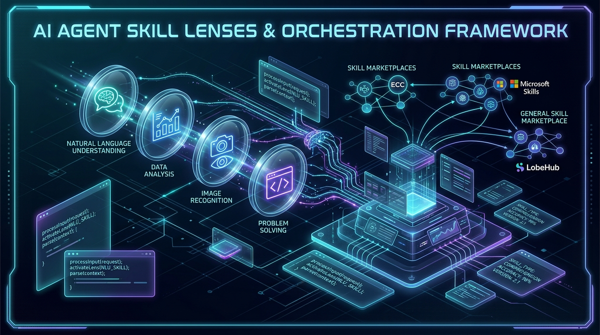
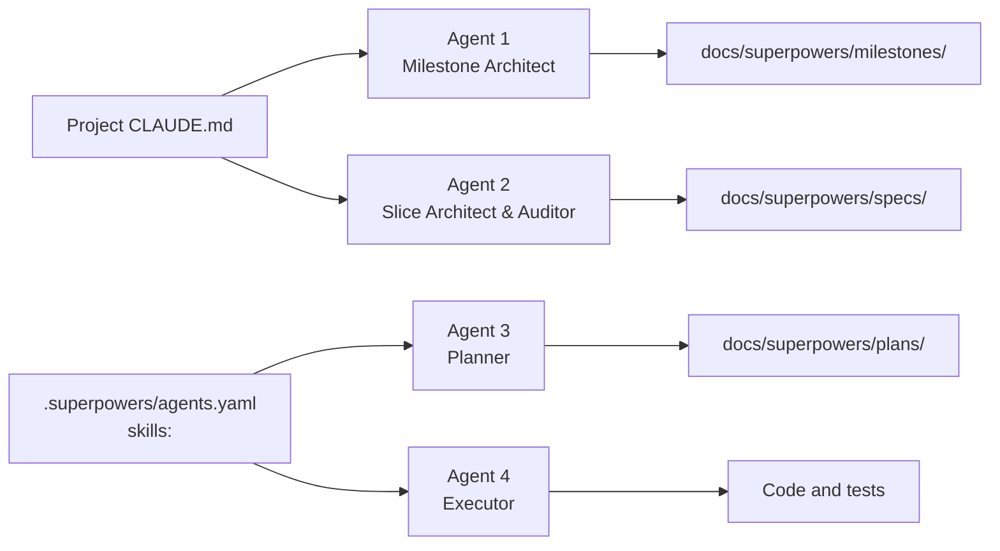

# Skill Lenses for the Strategic Layer



The `skills:` key in `agents.yaml` reinforces the roles this plugin dispatches.
It cannot reach the two it does not. This document covers that other half: how a
project wires lens selection into its own `CLAUDE.md` so the milestone and slice
architects choose deliberately instead of by accident.

Read it alongside **[Skills Worth Giving Your Agents](../README.md#-skills-worth-giving-your-agents)**,
which covers where to get a lens and how to install it. The mechanics of the
`agents.yaml` key are in
**[configuration.md](configuration.md#skills-per-role-reinforcement)**. The
definition below is the one place this document overlaps with the README on
purpose; nothing after it repeats either.

## What a lens is

**This is local vocabulary.** "Lens" is shorthand used in this repository, not a
term the Agent Skills ecosystem defines. Nothing installs, validates or resolves
a lens: a lens is an ordinary skill, and the word describes only the job you
hired it for. No harness will recognise it, and no catalogue is organised by it.

A lens is a skill that supplies **vocabulary and criteria for judgement** — the
Dependency Rule, bounded contexts, bulkheads and timeouts, diagnosis / guiding
policy / coherent action. You load it to reason about one document, and what it
changes is which sentences of that document you are willing to leave standing.

The word earns its place by what it excludes. A **pipeline** is a skill that
supplies its own route from work to release (`to-spec`, `to-tickets`,
`implement`, `tdd`). It does not sharpen the state machine this plugin runs — it
competes with it, and the model settles that conflict silently, without reporting
which of the two it followed.

| | Lens | Pipeline |
|---|---|---|
| Supplies | a way to think | a way to work |
| Relation to this plugin | composes with it | competes with it — it *is* an orchestrator |
| Evidence it was applied | the document reads differently | the run took a different route |
| Safe number | two per document | one per project, and you already run it |

The metaphor is doing real work: a lens adds nothing to the scene, it changes
what you resolve in it. Two sharpen; five muddy.

### Which problem this actually solves

Three problems are usually named together when a session carries many skills.
The word "lens" addresses one of them, and it is worth being precise about
which — the other two have their own mechanisms, and crediting them here would
buy you a false sense of coverage.

| Problem | What actually handles it |
|---|---|
| **Attention dilution** — twenty behavioural rules are followed less faithfully than two | Deliberate selection. This is the one a lens is for, and the honest reason for the ceiling of two |
| **Context cost** — instructions are not free | The format, not the choice. The harness keeps each skill's name and description in context and loads the body only on demand; picking a lens does not save those tokens, it spends them on purpose |
| **Conflict with the orchestrator** — a skill that runs its own workflow | The lens/pipeline distinction. Not a budget problem at all, and the reason this pair of words exists rather than a general plea for restraint |

> **Not the same as `SkillLens`.** A research framework of that name exists
> ([arXiv 2605.08386](https://arxiv.org/abs/2605.08386)) covering multi-granularity
> skill reuse to cut retrieval cost. Same word, different subject: it concerns
> *how much of a skill* to load, not *which kind of skill* composes with the
> workflow you already run.

## Why the strategic layer needs a different mechanism

The four-level model splits into two halves with different plumbing:

| Agent | Runs in | Reached through |
|---|---|---|
| 1 — Milestone & Track Architect | a human-facing session | the project's `CLAUDE.md` |
| 2 — Slice Architect & Auditor | a human-facing session | the project's `CLAUDE.md` |
| 3 — Implementation Planner | dispatched by the orchestrator | `agents.yaml` → `skills:` |
| 4 — TDD Executor | dispatched by the orchestrator | `agents.yaml` → `skills:` |



`DEFAULT_CONFIG` defines exactly two roles, `planner` and `executor`. Agents 1
and 2 have no entry, no `prompt_template`, and no dispatch — the orchestrator
never builds a prompt for them, so there is nothing for a `skills:` list to be
appended to.

Writing `agents: architect: {skills: [...]}` into `agents.yaml` does not fix
this. Validation accepts it, because role names are only checked when something
tries to dispatch them, and nothing ever dispatches that one. Configuration that
validates and is read by nobody is worse than configuration that is rejected:
you will believe it works.

The only channel that reaches a human-facing session unconditionally is its
instructions file.

## What actually reaches the model

Be clear about the guarantee you are buying:

| Tier | Mechanism | What it guarantees |
|---|---|---|
| Passive discovery | the harness scans its skills directories; each name and description enters the session | the model may never load it |
| Named in an instruction | a line in `CLAUDE.md`, or the sentence `skills:` appends to a dispatch prompt | far likelier to be loaded — still the model's call |
| Body injected | a `SessionStart` hook pasting the whole skill into context | present, no decision required; costs those tokens in every session |

A `CLAUDE.md` directive is the middle tier. It is a strong nudge from the
highest-priority source of instructions, and it is not enforcement. Any claim
that this makes quality deterministic is false — plan for a lens that gets
skipped, and check the document it was supposed to shape.

## Choose by dominant risk, not by topic

The useful question is not "what is this slice about" but "what is most likely
to be wrong about it a month from now". Match the lens to that.

| Document | The decision actually being made | Lens |
|---|---|---|
| milestone brief / PRD | Is this a strategy, or a list of goals wearing one? | `good-strategy-bad-strategy` |
| slice spec | Which layer owns this, and what does the domain call it? | `clean-architecture`, `domain-driven-design` |
| slice spec touching an external dependency | What happens when the thing we call is slow, wrong, or down? | `release-it` |
| slice spec with operator-facing screens | Can someone tell what this does without being told? | `design-everyday-things`, `ux-heuristics` |
| implementation plan | Are these tasks the right size, and will the code read well? | `clean-code`, `refactoring-patterns` |

**Two is the ceiling**, for the reason given above, and the same limit the
README recommends per dispatched role.

## Where to look

The README names the two sources to start from — **wondelai/skills** for
lens-shaped material and **skills.sh** for the CLI that installs into both
harnesses at once. The catalogues below are larger and less uniform, and worth
browsing once you know which risk you are shopping for.

Read a skill before adopting it. A skill is an instruction that overrides model
behaviour, so installing one unread is running unread code — and several of
these carry executable scripts alongside the Markdown.

| Catalogue | What is actually there | Worth knowing |
|---|---|---|
| [Microsoft Agent Skills](https://microsoft.github.io/skills/) | 174 MIT-licensed skills of Azure and cloud domain knowledge across Python, .NET, TypeScript, Java and Rust, plus MCP servers, agent templates and lifecycle hooks | Reference material, not a way to think. Reach for one when a slice genuinely touches that service |
| [LobeHub Skills](https://lobehub.com/skills) | A marketplace indexing `SKILL.md`-format skills from many upstream repositories, installable with `npx skills add` | What you are vetting is the upstream repository, not the listing page |
| [SkillsLLM](https://skillsllm.com/) | A directory of 4000+ entries in ten categories, mixing agent skills, MCP servers, CLI tools and IDE extensions | Broad, and mixes artefact kinds. Its "security-vetted" label is the site's claim, not an audit you ran |
| [MCP Market — Agent Skills](https://mcpmarket.com/tools/skills) | A commercial marketplace whose skills directory is separate from its MCP-server directory | Skills and MCP servers solve different problems; do not read the two catalogues as one |
| [affaan-m/ECC](https://github.com/affaan-m/ECC) | 281 skills, 67 agents and 94 commands under MIT — an entire agent harness, with shell, Python and Node hooks | **A pipeline, by the rule above.** It ships its own plan → test → implement → review → verify loop, which competes with the state machine you already run. Mine it for one skill; do not adopt it wholesale |
| [SriramGandhiS/Skills](https://github.com/SriramGandhiS/Skills) | A twelve-skill "mandatory stack" and protocol-enforcement registry for the Antigravity ecosystem, MIT, with PowerShell and shell scripts | Also pipeline-shaped, and it installs by symlink — the thing that breaks on Windows and inside git worktrees |

Both harnesses discover whatever you install, so a lens taken from any of these
reaches Agents 1 and 2 with no further configuration. What it will not do is
select itself — that is what the block below is for.

## The block to paste into your `CLAUDE.md`

Adjust the paths if you have moved the document tree.

```markdown
## Lens selection (Agents 1 and 2)

Before writing a milestone brief (`docs/superpowers/milestones/`), a slice spec
(`docs/superpowers/specs/`) or a plan (`docs/superpowers/plans/`):

1. State the document's dominant risk in one sentence — what is most likely to
   be wrong about it in a month.
2. Load at most two skills that address that risk. Prefer a lens, a way to
   think, over anything that proposes its own route from work to release.
3. Reason through the document with them. A lens that changed no sentence of
   the result was the wrong lens, or was never applied.
4. Record the choice in the document's frontmatter under `skills:` — the key
   `agents.yaml` uses for a role, one scope down:
   `skills: [clean-architecture, domain-driven-design]`.

When you OPEN a document that already declares `skills:` — to audit it, to plan
against it, or to pick the work back up — load those skills before reasoning
about it, and say which ones you loaded. That declaration is how a lens survives
from the session that chose it to the session that has to honour it. Nothing
loads it for you.

Installed for this project: <list your set here>.
```

Keep that last line current. A name that no longer resolves produces no error
anywhere along this path — the instruction simply has nothing to load.

## What a document's `skills:` key does, and what it cannot do

The name is deliberate rather than new. `agents.yaml` already attaches skills to
a role under `skills:`; a document's frontmatter attaches them to that document.
One vocabulary, two scopes — and if the merge described below is ever built, it
joins two like-named lists instead of translating between two words.

On its own the key is inert: it is frontmatter, and no code in this plugin
parses it. It becomes useful only because the block above gives it a reader —
the rule that a session opening the document loads what the document declares.
Written without that rule, the key is an audit note and nothing more.

That leaves the dispatched half uncovered. When the planner is dispatched against
a spec, the orchestrator parses that file's frontmatter for `status` and
`depends_on`; it could read the spec's `skills:` as well and merge those names
into the role's list, giving a slice its own lenses instead of only its role's.
That would be a change to the plugin, not an instruction, and it is not
implemented. Until it is, a lens intended for the planner or the executor belongs
in `agents.yaml`.

If you would rather not carry a key that only instructions honour, drop it. The
lens still works; what you lose is the record of which one shaped the document
and why — which is most of the value when someone reviews the spec six weeks
later.

## Two ways this goes wrong

**Taking a pipeline for a lens.** The distinction is clear on paper and blurred
in a catalogue listing, where both arrive as one line of description. Apply the
rule of thumb before installing: a description containing a workflow is one you
already have; a description containing a vocabulary is one you probably want.
The larger the bundle, the likelier it is the former — a repository shipping
scores of skills alongside hooks and commands is a harness, whatever its README
calls it.

**Turning a lens into a checklist.** A lens changes how you reason; it does not
hand you acceptance criteria. "Must pass an OWASP JWT check" belongs in a spec
because your threat model put it there, not because a skill appeared in a list.
Lenses that arrive as compliance boxes get ticked on paper and change nothing in
the design — which looks like the practice working while it is not.

## Verify

Ask the harness what it resolved. No model call, no cost:

```bash
opencode debug skill
```

In Claude Code the equivalent list arrives with the session's available skills.

Neither answers the question that matters, which is whether the lens was
applied. Only the document answers that: if the spec would read identically
without it, the lens did nothing. Notice that early, rather than accumulating
configuration that merely looks like it works.
